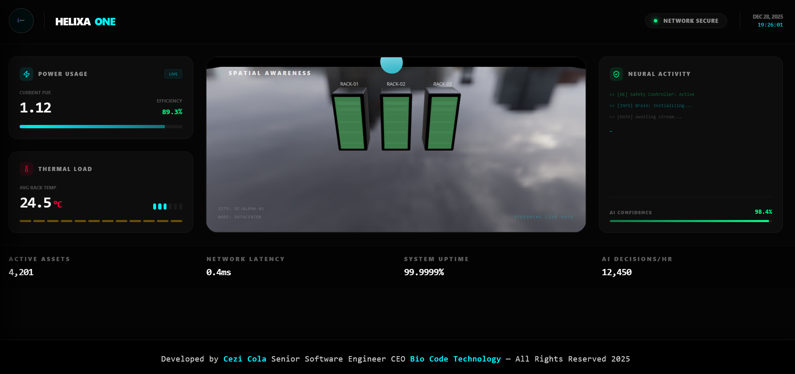
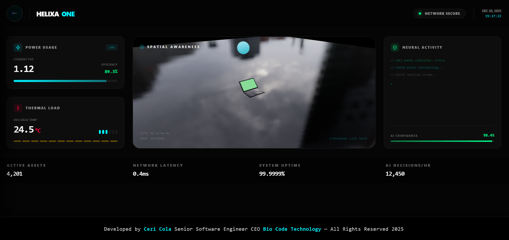
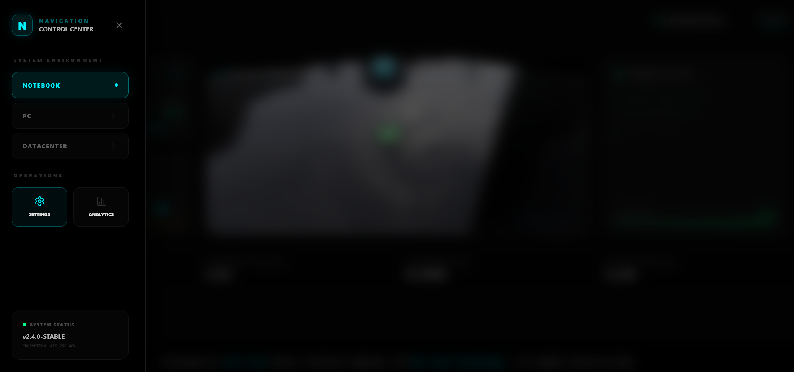

# Helixa-One: Data Center Digital Brain

Helixa-One operates as a digital brain for mission-critical data centers, combining telemetry ingestion through SNMP, MQTT, Modbus, and gRPC with advanced analytics and responsive visualization. Continuous predictions, anomaly triage, and safety enforcement maintain optimal power usage effectiveness (PUE) while protecting infrastructure limits.

## Production Dashboard Snapshots

| Perspective                       | Preview                                                             |
| --------------------------------- | ------------------------------------------------------------------- |
| **Data Center Spatial Awareness** |  |
| **Rack-Level Thermal Insight**    |             |
| **Notebook Digital Twin**         |         |
| **Control-Center Navigation**     |        |
| **AI Confidence Dashboard**       |   |

### Snapshot Details

- **Data Center Spatial Awareness** — apresenta três racks monitorados, com o orbe de controle posicional supervisionando deslocamentos e eficiência.
- **Rack-Level Thermal Insight** — evidencia o painel térmico ao vivo, exibindo média de 24,5 °C e indicadores de eficiência energética.
- **Notebook Digital Twin** — demonstra a versão edge do digital twin, confirmando suporte a dispositivos móveis e layout adaptável.
- **Control-Center Navigation** — mostra o painel lateral retrátil com seleção de ambientes, acesso a Settings/Analytics e estado criptografado v2.4.0-Stable.
- **AI Confidence Dashboard** — ressalta o log do Safety Controller, telemetria em streaming e confiança operacional de 98,4%.

#### Additional Production Views

| Scene                       | Preview                                                 |
| --------------------------- | ------------------------------------------------------- |
| **Datacenter Control Loop** |       |
| **PC Mode Twin**            |            |
| **Notebook Twin**           |      |
| **Navigation Drawer**       |  |

## Core Capabilities

- Digital twin orchestration with 3D visualization and real-time state synchronization
- Predictive maintenance models powered by PyTorch and Scikit-learn pipelines
- Thermal load forecasting supported by adaptive sampling of incoming telemetry streams
- Safety Controller enforcing physical thresholds before any autonomous command is accepted
- Supabase-backed storage delivering time-series durability and realtime dashboards
- Observability powered by OpenTelemetry traces, structured logs, and Prometheus-ready metrics

## System Architecture (CEZI COLA)

- **Risk**: Every outbound decision travels through `app/core/safety.py`, applying deterministic guardrails, idempotent retries, and rollback modeling.
- **Architecture**: Hexagonal separation places business logic under `services/brain/app`, ingestion adapters in `services/nerves`, and presentation logic in `services/face`.
- **Scale**: Dockerized microservices with horizontal scaling hooks for ingestion workers, model services, and Supabase replicas.
- **Observability**: Unified tracing context propagated across FastAPI, Supabase, and Next.js via OpenTelemetry instrumentation.

## Service Topology

| Service                                | Role                                                      | Key Technologies                                 |
| -------------------------------------- | --------------------------------------------------------- | ------------------------------------------------ |
| `services/nerves`                      | Telemetry ingestion and device emulation                  | Python, AsyncIO, custom SNMP/MQTT/Modbus clients |
| `services/brain`                       | Intelligence engine, anomaly lab, safety layer            | Python, FastAPI, PyTorch, Scikit-learn           |
| `services/brain/app/core/database.py`  | Supabase connection pool and query builders               | `asyncpg`, SQLAlchemy-style orchestration        |
| `services/brain/app/engine/anomaly.py` | Statistical baselines, z-score, and ML ensemble detection | NumPy, PyTorch                                   |
| `services/face`                        | Operator command interface and dashboards                 | Next.js 14, App Router, Tailwind CSS             |
| `services/face/src/lib/supabase.ts`    | Realtime client wiring                                    | Supabase JS SDK                                  |
| `infrastructure`                       | Docker Compose, database bootstrap, secrets layout        | Docker, Supabase SQL                             |

## Telemetry and Analytics Flow

1. Devices stream metrics into `services/nerves`, which normalizes payloads, attaches metadata, and publishes via Supabase Realtime.
2. `services/brain` subscribes to events, executes anomaly scoring, and stores enriched telemetry in PostgreSQL.
3. The Safety Controller validates any control signals against thermal envelopes, electrical thresholds, and fail-safe scenarios.
4. `services/face` consumes realtime channels, updating 3D visualization layers, KPI scorecards, and operations logbook without page reloads.

## Technology Stack

- **Languages**: Python, TypeScript
- **Frameworks**: FastAPI, Next.js (App Router), Tailwind CSS
- **Data & Messaging**: Supabase (PostgreSQL + Realtime), AsyncIO pipelines
- **ML Tooling**: PyTorch, Scikit-learn, NumPy, Pandas
- **Telemetry Protocols**: SNMP, MQTT, Modbus, gRPC
- **Observability**: OpenTelemetry, Prometheus exporters, structured logging
- **Containerization**: Docker, docker-compose

## Development Workflow

### Prerequisites

- Node.js 18+
- Python 3.11+
- Docker Desktop with Compose
- Supabase project (self-hosted or cloud)

### Environment Initialization

1. Duplicate `.env.example` to `.env` within each service requiring secrets.
2. Populate Supabase URL, anon key, and service role key.
3. Execute `infrastructure/supabase_setup.sql` through the Supabase SQL editor to provision tables, policies, and realtime channels.

### Running the Ecosystem

```bash
docker-compose -f infrastructure/docker-compose.yml up --build
```

### Local-Only Execution

- **Brain Service**
  ```bash
  cd services/brain
  pip install -r requirements.txt
  uvicorn app.main:app --reload
  ```
- **Nerves Service**
  ```bash
  cd services/nerves
  pip install -r requirements.txt
  python main.py
  ```
- **Face Service (Dashboard)**
  ```bash
  cd services/face
  npm install
  npm run dev
  ```

### Production Build

```bash
cd services/face
npm run build
npm run start
```

## Observability and Safety Controls

- OpenTelemetry spans wrap ingestion, inference, and dashboard delivery for correlation-friendly traces.
- Health probes and Prometheus metrics exported at `/metrics` inside `services/brain` align with SRE dashboards.
- Safety Controller maintains deterministic rollback, saturating asset thresholds before executing adjusting commands.
- Supabase row-level security and policy definitions guard multi-tenant scenarios out of the box.

## Security and Compliance Considerations

- Secrets remain outside version control via `.env` patterns described in `StartSoftware.txt`.
- TLS termination recommended at ingress level; internal services communicate through private Docker networks.
- Audit trails logged in structured JSON for downstream SIEM ingestion.

## Documentation and Further Reading

- `ARCHITECTURE.md`: High-level CEZI COLA map and design tenets
- `services/brain/app/schemas`: Pydantic schemas governing telemetry contracts
- `services/face/src/components/DigitalTwin.tsx`: 3D rendering workflow
- `services/nerves/requirements.txt`: Protocol driver dependencies

---

Developed by Cezi Cola Senior Software Engineer CEO Bio Code Technology — All Rights Reserved 2025
